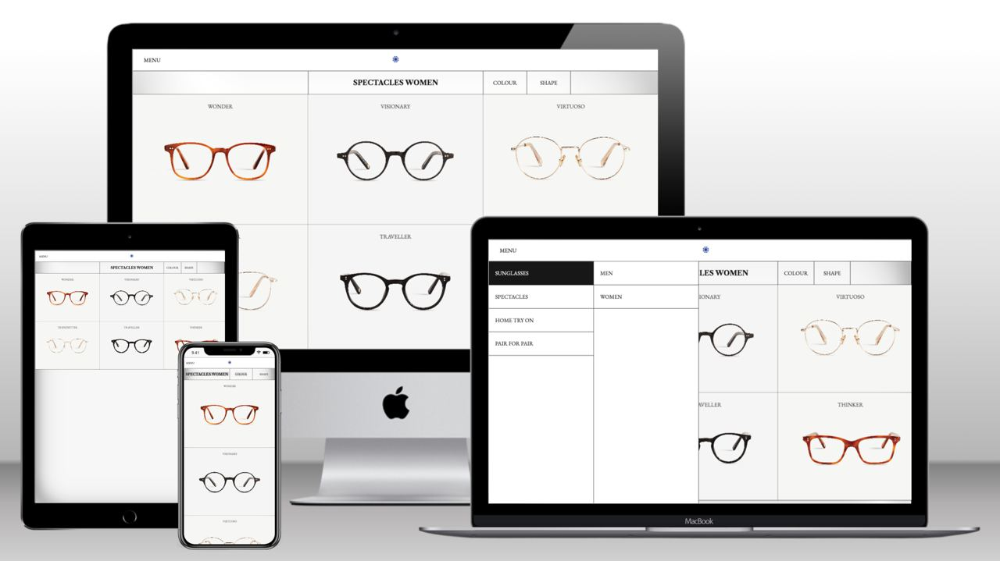

# E-commerce Store

Simple single page application which has the following
components:

1. Collections menu.
2. Glasses view.

## What's next?

- Refactor sidebar menu, fix tiny bugs on mobile version
- Implement infinite scroll for product list
- Implement filters (by shape and colour)
- Make Flux structure of state management in hooks generic
- Improve product view page
- Markup Error Page

## Preview

    

## Tech Stack

- [CRA](https://create-react-app.dev/) - is an officially supported way to create single-page React applications. It offers a modern build setup with no configuration.
- [Typescript](https://www.typescriptlang.org/) - is a strongly typed programming language that builds on JavaScript, giving you better tooling at any scale.
- [styled-components](https://styled-components.com/) - using the best bits of ES6 and CSS to style your apps.
